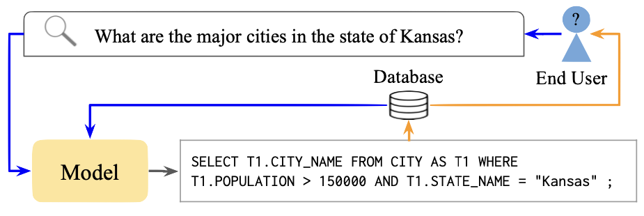
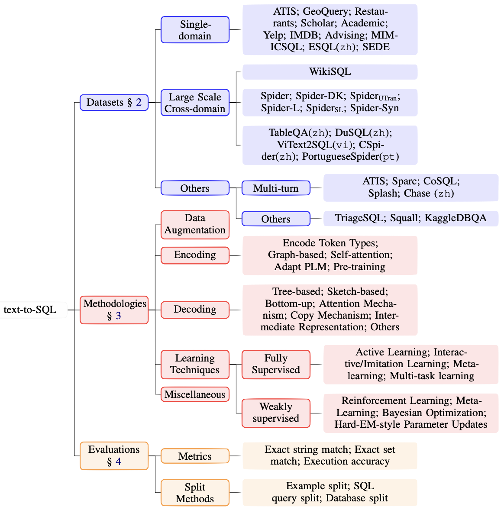

# Recent Advances in Text-to-SQL:<br>A Survey of What We Have and What We Expect
<table align=center>
  <table align=center>
    <tr>
      <td>
          <h2><a href="https://dnaihao.github.io">Naihao Deng</a></h2>   
      </td>
      <td>
          <h2><a href="https://scholar.google.com/citations?user=8P23zSkAAAAJ&hl=en">Yulong Chen</a></h2>
      </td>
      <td>
          <h2><a href="https://frcchang.github.io">Yue Zhang</a></h2>
      </td>
    </tr>
  </table>
  <table align=center>
    <tr>
      <td>
          <h2><a href=''>[Paper]</a></h2>
      </td>
      <td>
          <h2><a href='https://github.com/text-to-sql-survey-coling22/text-to-sql-survey-coling22.github.io'>[GitHub]</a></h2>
      </td>
    </tr>
  </table>
</table>


<table align=center width=850px>
		<h1>Abstract</h1>
		<tr>
			<td>
				Text-to-SQL has attracted attention from both the natural language processing and database communities because of its ability to convert the semantics in natural language into SQL queries and its practical application in building natural language interfaces to database systems.
        <br>The major challenges in text-to-SQL lie in encoding the meaning of natural utterances, decoding to SQL queries, and translating the semantics between these two forms.
        <br>These challenges have been addressed to different extents by the recent advances.
        <br>However, there is still a lack of comprehensive surveys for this task.
        <br>To this end, we review recent progress on text-to-SQL for datasets, methods, and evaluation and provide this systematic survey, addressing the aforementioned challenges and discussing potential future directions.
        <br>We hope this survey can serve as quick access to existing work and motivate future research.
			</td>
		</tr>
	</table>


# Citation

If you would like to cite our work, please cite the following work:

> Naihao Deng, Yulong Chen, and Yue Zhang. 2022. Recent Advances in Text-to-SQL:
A Survey of What We Have and What We Expect

```
@misc{deng2022recent,
      title={Recent Advances in Text-to-SQL: A Survey of What We Have and What We Expect}, 
      author={Naihao Deng and Yulong Chen and Yue Zhang},
      year={2022},
      eprint={2208.10099},
      archivePrefix={arXiv},
      primaryClass={cs.CL}
}
```

<h1>Survey Sketch</h1>

## Concept Diagram

|| 
|:--:| 
| The framework for text-to-SQL systems. Given the database schema and user utterance, the system outputs a corresponding SQL query to query the database system for the result. Appendix B gives more text-to-SQL examples.|


| | 
|:--:| 
| Topology for text-to-SQL. Format adapted from <a href="https://arxiv.org/abs/2107.13586" target="_blank">(Liu et al., 2021a)</a>|


## Datasets


<table>
<thead>
  <tr>
    <th>Datasets</th>
    <th>#Size</th>
    <th>#DB</th>
    <th>#D</th>
    <th>#T/DB</th>
    <th>Issues addressed</th>
    <th>Sources for data</th>
  </tr>
</thead>
<tbody>
  <tr>
    <td>Spider <a href='https://doi.org/10.18653/v1/D18-1425' target='_blank'>(Yu et al., 2018c)</a></td>
    <td align='right'>10,181</td>
    <td align='right'>200</td>
    <td align='right'>138</td>
    <td align='right'>5.1</td>
    <td>Domain generalization</td>
    <td>College courses, DabaseAnswers, WikiSQL</td>
  </tr>
  <tr>
    <td>Spider-DK <a href='https://doi.org/10.18653/v1/2021.emnlp-main.702' target='_blank'>(Gan et al., 2021b)</a></td>
    <td align='right'>535</td>
    <td align='right'>10</td>
    <td align='right'>-</td>
    <td align='right'>4.8</td>
    <td>Domain knowledge</td>
    <td>Spider dev set</td>
  </tr>
  <tr>
    <td>Spiderutran <a href='https://doi.org/10.18653/v1/2020.acl-demos.24' target='_blank'>(Zeng et al., 2020)</a></td>
    <td align='right'>15,023</td>
    <td align='right'>200</td>
    <td align='right'>138</td>
    <td align='right'>5.1</td>
    <td>Untranslatable questions</td>
    <td>Spider + 5,330 untranslatable questions</td>
  </tr>
  <tr>
    <td>Spider-L <a href='https://doi.org/10.18653/v1/2020.emnlp-main.564' target='_blank'>(Lei et al., 2020)</a></td>
    <td align='right'>8,034</td>
    <td align='right'>160</td>
    <td align='right'>-</td>
    <td align='right'>5.1</td>
    <td>Schema Unking</td>
    <td>Spider train/dev</td>
  </tr>
  <tr>
    <td>SpiderSL <a href='https://arxiv.org/abs/2102.01847' target='_blank'>(Taniguchi et al., 2021)</a></td>
    <td align='right'>1,034</td>
    <td align='right'>10</td>
    <td align='right'>-</td>
    <td align='right'>4.8</td>
    <td>Schema linking</td>
    <td>Spider dev set</td>
  </tr>
  <tr>
    <td>Spider-Syn <a href='https://doi.org/10.18653/v1/2021.acl-long.195' target='_blank'>(Gan et al., 2021a)</a></td>
    <td align='right'>8,034</td>
    <td align='right'>160</td>
    <td align='right'>-</td>
    <td align='right'>5.1</td>
    <td>Robustness</td>
    <td>Spider train/dev</td>
  </tr>
  <tr>
    <td>WikiSQL <a href='https://arxiv.org/abs/1709.00103' target='_blank'>(Zhong et al., 2017)</a></td>
    <td align='right'>80,654</td>
    <td align='right'>26,521</td>
    <td align='right'>-</td>
    <td align='right'>1</td>
    <td>Data size</td>
    <td>Wikipedia</td>
  </tr>
  <tr>
    <td>Squall <a href='https://doi.org/10.18653/v1/2020.findings-emnlp.167' target='_blank'>(Shi et al., 2020b)</a></td>
    <td align='right'>11,468</td>
    <td align='right'>1,679</td>
    <td align='right'>-</td>
    <td align='right'>1</td>
    <td>Lexicon-level supervision</td>
    <td>WikiTableQuestions <a href='https://doi.org/10.3115/v1/P15-1142' target='_blank'>(Pasupat and Liang, 2015)</a></td>
  </tr>
  <tr>
    <td>KaggleDBQA <a href='https://doi.org/10.18653/v1/2021.acl-long.176' target='_blank'>(Lee et al., 2021)</a></td>
    <td align='right'>272</td>
    <td align='right'>8</td>
    <td align='right'>8</td>
    <td align='right'>2.3</td>
    <td>Domain generalization</td>
    <td>Real web daabases</td>
  </tr>
  <tr style="border-bottom: 1px solid #000;">
  <tr>
    <td>ATIS <a href='https://aclanthology.org/H90-1020' target='_blank'>(Price, 1990)</a>, <a href='https://aclanthology.org/H94-1010' target='_blank'>(Dahl et al., 1994)</a></td>
    <td align='right'>5,280</td>
    <td align='right'>1</td>
    <td align='right'>1</td>
    <td align='right'>32</td>
    <td>-</td>
    <td>FUght-booking</td>
  </tr>
  <tr>
    <td>GeoQuery <a href='https://www.cs.utexas.edu/~ml/papers/chill-aaai-96.pdf' target='_blank'>(Zelle and Mooney, 1996)</a></td>
    <td align='right'>877</td>
    <td align='right'>1</td>
    <td align='right'>1</td>
    <td align='right'>6</td>
    <td>-</td>
    <td>US geography</td>
  </tr>
  <tr>
    <td>Scholar <a href='https://doi.org/10.18653/v1/P17-1089' target='_blank'>(Iyer et al., 2017)</a></td>
    <td align='right'>817</td>
    <td align='right'>1</td>
    <td align='right'>1</td>
    <td align='right'>7</td>
    <td>-</td>
    <td>Academic publications</td>
  </tr>
  <tr>
    <td>Academic <a href='https://www.vldb.org/pvldb/vol8/p73-li.pdf' target='_blank'>(Li and Jagadish, 2014)</a></td>
    <td align='right'>196</td>
    <td align='right'>1</td>
    <td align='right'>1</td>
    <td align='right'>15</td>
    <td>-</td>
    <td>Microsoft Academic Search (MAS)</td>
  </tr>
  <tr>
    <td>IMDB <a href='https://dl.acm.org/doi/10.1145/3133887' target='_blank'>(Yaghmazadeh et al., 2017)</a></td>
    <td align='right'>131</td>
    <td align='right'>1</td>
    <td align='right'>1</td>
    <td align='right'>16</td>
    <td>-</td>
    <td>database Internet Movie Database</td>
  </tr>
  <tr>
    <td>Yelp <a href='https://dl.acm.org/doi/10.1145/3133887' target='_blank'>(Yaghmazadeh et al., 2017)</a></td>
    <td align='right'>128</td>
    <td align='right'>1</td>
    <td align='right'>1</td>
    <td align='right'>7</td>
    <td>-</td>
    <td>Yelp website</td>
  </tr>
  <tr>
    <td>Advising <a href='https://doi.org/10.18653/v1/P18-1033' target='_blank'>(Finegan-Dollak et al., 2018)</a></td>
    <td align='right'>3,898</td>
    <td align='right'>1</td>
    <td align='right'>1</td>
    <td align='right'>10</td>
    <td>-</td>
    <td>University of Michigan course</td>
  </tr>
  <tr>
    <td>Restaurants <a href='https://doi.org/10.3115/1117794.1117811' target='_blank'>(Tang and Mooney, 2000)</a> <a href='https://dl.acm.org/doi/10.1145/604045.604070' target='_blank'>(Popescu et al., 2003)</a></td>
    <td align='right'>378</td>
    <td align='right'>1</td>
    <td align='right'>1</td>
    <td align='right'>3</td>
    <td>-</td>
    <td>information Restaurants</td>
  </tr>
  <tr>
    <td>MIMICSQL <a href='https://doi.org/10.1145/3366423.3380120' target='_blank'>(Wang et al., 2020d)</a></td>
    <td align='right'>10,000</td>
    <td align='right'>1</td>
    <td align='right'>1</td>
    <td align='right'>5</td>
    <td>-</td>
    <td>Healthcare domain</td>
  </tr>
  <tr>
    <td>SEDE <a href='https://doi.org/10.18653/v1/2021.nlp4prog-1.9' target='_blank'>(Hazoom et al., 2021)</a></td>
    <td align='right'>12,023</td>
    <td align='right'>1</td>
    <td align='right'>1</td>
    <td align='right'>29</td>
    <td>SQL template diversity</td>
    <td>Stack Exchange</td>
  </tr>
  <tr>
    <td colspan=7 align='center'>Summarization for text-to-SQL datasets. #Size, #DB, #D, and #T/DB represent the number of question-SQL
pairs, databases, domains, and tables per domain, respectively. We put “-” in the #D column because we do not
know how many domains are in the Spider dev set and “-” in the Issues Addressed column because there is no
specific issue addressed for the dataset. Datasets above and below the line are cross-domain and single-domain,
respectively.</td>
  </tr>
</tbody>
</table>


### Other relevant datasets


* Chinest text-to-SQL: 
  * CSpider <a href='https://doi.org/10.18653/v1/D19-1377' target='_blank'>(Min et al., 2019a)</a>
  * TableQA <a href='https://arxiv.org/abs/2006.06434' target='_blank'>(Sun et al., 2020)</a>
  * DuSQL <a href='https://doi.org/10.18653/v1/2020.emnlp-main.562' target='_blank'>(Wang et al., 2020c)</a>
  * ESQL <a href='https://arxiv.org/abs/2109.05395' target='_blank'>(Chen et al., 2021a)</a>
* Vietnamese text-to-SQL: ViText2SQL <a href='https://doi.org/10.18653/v1/2020.findings-emnlp.364' target='_blank'>(Tuan Nguyen et al., 2020)</a>
* Portuguese text-to-SQL: (José and Cozman, 2021)
* Multi-turn context-dependent text-to-SQL:
  * ATIS <a href='https://aclanthology.org/H90-1020' target='_blank'>(Price, 1990)</a> <a href='https://aclanthology.org/H94-1010' target='_blank'>(Dahl et al., 1994)</a>
  * Sparc <a href='https://doi.org/10.18653/v1/P19-1443' target='_blank'>(Yu et al., 2019b)</a>
  * CoSQL <a href='https://doi.org/10.18653/v1/D19-1204' target='_blank'>(Yu et al., 2019a)</a>
* Unanswerable questions: TriageSQL <a href='https://arxiv.org/abs/2010.12634' target='_blank'>(Zhang et al., 2020)</a>


### Resources

* [This Github Repo](https://github.com/jkkummerfeld/text2sql-data) holds data for many of the single domain datasets including Academic, Advising, ATIS, Geography, IMDB, Restaurants, Scholar, Yelp; as well as cross-domain datasets including Spider and WikiSQL. The Github Repo is the official repo for [This paper](https://aclanthology.org/P18-1033/), and their methods of processding the data is described in the paper as well.

* [The official Spider leaderboard](https://yale-lily.github.io/spider) shows the performance of models on Spider dev and the hidden test set.

* [The official WikiSQL Github Repo](https://github.com/salesforce/WikiSQL) holds leaderboard for models on WikiSQL dataset.


<!-- Note of jonanthan's data; note of wikisql and spider leaderboard -->


## Methods


### Data Augmentation


* Typical effects:
  * Handle complex or unseen questions <a href='https://doi.org/10.18653/v1/2020.emnlp-main.558' target='_blank'>(Zhong et al., 2020b)</a>, <a href='https://doi.org/10.18653/v1/2021.naacl-main.220' target='_blank'>(Wang et al., 2021b)</a>
  * Achieve state-of-the-art with less supervised data <a href='https://doi.org/10.18653/v1/D18-1188' target='_blank'>(Guo et al., 2018)</a>
  * Attain robustness towards different types of questions <a href='https://arxiv.org/abs/2010.09927' target='_blank'>(Radhakrishnan et al., 2020)</a>

* Data generation methods:
  * <a href='https://doi.org/10.18653/v1/P17-1089' target='_blank'>(Iyer et al., 2017)</a>
  * <a href='https://arxiv.org/abs/2011.03836' target='_blank'>(Li et al., 2020a)</a>

* Quality control of the generated data:
  * <a href='https://doi.org/10.18653/v1/2020.emnlp-main.558' target='_blank'>(Zhong et al., 2020b)</a>
  * <a href='https://doi.org/10.18653/v1/2021.emnlp-main.707' target='_blank'>(Wu et al., 2021)</a>

* Diversify the generated data:
  * <a href='https://doi.org/10.18653/v1/D18-1188' target='_blank'>(Guo et al., 2018)</a>
  * <a href='https://arxiv.org/abs/2010.09927' target='_blank'>(Radhakrishnan et al., 2020)</a>
  * <a href='https://doi.org/10.18653/v1/2021.naacl-main.220' target='_blank'>(Wang et al., 2021b)</a>


### Encoding


<table class="tg">
<thead>
  <tr>
    <th class="tg-0pky">Methods</th>
    <th class="tg-0pky">Adopted by</th>
    <th class="tg-dvpl">Applied datasets</th>
    <th class="tg-0pky">Addressed challenges</th>
  </tr>
</thead>
<tbody>
  <tr>
    <td class="tg-0pky">Encode token type</td>
    <td class="tg-0pky">TypeSQL <a href='https://doi.org/10.18653/v1/N18-2093' target='_blank'>(Yu et al., 2018a)</a></td>
    <td class="tg-dvpl">WikiSQL</td>
    <td class="tg-0pky">Representing question meaning</td>
  </tr>
  <tr>
    <td class="tg-0pky" rowspan=8>Graph-based</td>
    <td class="tg-0pky">GNN <a href='https://doi.org/10.18653/v1/P19-1448' target='_blank'>(Bogin et al., 2019a)</a></td>
    <td class="tg-dvpl">Spider</td>
    <td class="tg-0pky" rowspan=13>(1)    Representing question and DB schemas in a structured way (2)    Schema linking</td>
  </tr>
  <tr>
    <td class="tg-0pky">Global-GCN <a href='https://doi.org/10.18653/v1/D19-1378' target='_blank'>(Bogin et al., 2019b)</a></td>
    <td class="tg-dvpl">Spider</td>
  </tr>
  <tr>
    <td class="tg-0pky">IGSQL <a href='https://doi.org/10.18653/v1/2020.emnlp-main.560' target='_blank'>(Cai and Wan, 2020)</a></td>
    <td class="tg-dvpl">Sparc, CoSQL</td>
  </tr>
  <tr>
    <td class="tg-0pky">RAT-SQL <a href='https://doi.org/10.18653/v1/2020.acl-main.677' target='_blank'>(Wang et al., 2020a)</a></td>
    <td class="tg-dvpl">Spider</td>
  </tr>
  <tr>
    <td class="tg-0pky">LEGSQL <a href='https://doi.org/10.18653/v1/2021.acl-long.198' target='_blank'>(Cao et al., 2021)</a></td>
    <td class="tg-dvpl">Spider</td>
  </tr>
  <tr>
    <td class="tg-0pky">SADGA <a href='https://proceedings.neurips.cc/paper/2021/hash/3f1656d9668dffcf8119e3ecff873558-Abstract.html' target='_blank'>(Cai et al., 2021)</a></td>
    <td class="tg-dvpl">Spider</td>
  </tr>
  <tr>
    <td class="tg-0pky">ShawdowGNN <a href='https://doi.org/10.18653/v1/2021.naacl-main.441' target='_blank'>(Chen et al., 2021b)</a></td>
    <td class="tg-dvpl">Spider</td>
  </tr>
  <tr>
    <td class="tg-0pky">S2SQL <a href='https://arxiv.org/abs/2203.06958' target='_blank'>(Hui et al., 2022)</a></td>
    <td class="tg-dvpl">Spider, Spider-Syn</td>
  </tr>
  <tr>
    <td class="tg-0pky" rowspan=5>Self-attention</td>
    <td class="tg-0pky">X-SQL <a href='https://arxiv.org/abs/1908.08113' target='_blank'>(He et al., 2019)</a></td>
    <td class="tg-dvpl">WikiSQL</td>
  </tr>
  <tr>
    <td class="tg-0pky">SQLova <a href='https://arxiv.org/abs/1902.01069' target='_blank'>(Hwang et al., 2019)</a></td>
    <td class="tg-dvpl">WikiSQL</td>
  </tr>
  <tr>
    <td class="tg-0pky">RAT-SQL <a href='https://doi.org/10.18653/v1/2020.acl-main.677' target='_blank'>(Wang et al., 2020a)</a></td>
    <td class="tg-dvpl">Spider</td>
  </tr>
  <tr>
    <td class="tg-0pky">DuoRAT <a href='https://doi.org/10.18653/v1/2021.naacl-main.103' target='_blank'>(Scholak et al., 2021a)</a></td>
    <td class="tg-dvpl">Spider</td>
  </tr>
  <tr>
    <td class="tg-0pky">UnifiedSKG <a href='https://arxiv.org/abs/2201.05966' target='_blank'>(Xie et al., 2022)</a></td>
    <td class="tg-dvpl">WikiSQL, Spider</td>
  </tr>
  <tr>
    <td class="tg-0pky" rowspan=5>Adapt PLM</td>
    <td class="tg-0pky">X-SQL <a href='https://arxiv.org/abs/1908.08113' target='_blank'>(He et al., 2019)</a></td>
    <td class="tg-dvpl">WikiSQL</td>
    <td class="tg-0pky" rowspan=8>Leveraging external data to represent question and DB schemas</td>
  </tr>
  <tr>
    <td class="tg-0pky">SQLova <a href='https://arxiv.org/abs/1902.01069' target='_blank'>(Hwang et al., 2019)</a></td>
    <td class="tg-dvpl">WikiSQL</td>
  </tr>
  <tr>
    <td class="tg-0pky"><a href='https://arxiv.org/abs/1910.07179' target='_blank'>(Guo and Gao, 2019)</a></td>
    <td class="tg-dvpl">WikiSQL</td>
  </tr>
  <tr>
    <td class="tg-0pky">HydraNet <a href='https://arxiv.org/abs/2008.04759' target='_blank'>(Lyu et al., 2020)</a></td>
    <td class="tg-dvpl">WikiSQL</td>
  </tr>
  <tr>
    <td class="tg-0pky"><a href='https://doi.org/10.18653/v1/2021.findings-acl.100' target='_blank'>(Liu et al., 2021b)</a>, etc</td>
    <td class="tg-dvpl">Spider-L, SQUALL</td>
  </tr>
  <tr>
    <td class="tg-0pky" rowspan=3>Pre-training</td>
    <td class="tg-0pky">TaBERT <a href='https://doi.org/10.18653/v1/2020.acl-main.745' target='_blank'>(Yin et al., 2020)</a></td>
    <td class="tg-dvpl">Spider</td>
  </tr>
  <tr>
    <td class="tg-0pky">GraPPA <a href='https://openreview.net/forum?id=kyaIeYj4zZ' target='_blank'>(Yu et al., 2021)</a></td>
    <td class="tg-dvpl">Spider</td>
  </tr>
  <tr>
    <td class="tg-0pky">GAP <a href='https://arxiv.org/abs/2012.10309' target='_blank'>(Shi et al., 2020a)</a></td>
    <td class="tg-dvpl">Spider</td>
  </tr>
  <tr>
    <td colspan=4 align='center'>Methods used for encoding in text-to-SQL.</td>
  </tr>
</tbody>
</table>


## Decoding


<table>
<thead>
  <tr>
    <th>Methods</th>
    <th></th>
    <th>Adopted by</th>
    <th>Applied datasets</th>
    <th>Addressed challenges</th>
  </tr>
</thead>
<tbody>
  <tr>
    <td rowspan=3>Tree-based</td>
    <td></td>
    <td>Seq2Tree <a href='https://doi.org/10.18653/v1/P16-1004' target='_blank'>(Dong and Lapata, 2016)</a></td>
    <td>-</td>
    <td rowspan=8>Hierarchical decoding</td>
  </tr>
  <tr>
    <td></td>
    <td>Seq2AST <a href='https://doi.org/10.18653/v1/P17-1041' target='_blank'>(Yin and Neubig, 2017)</a></td>
    <td>-</td>
  </tr>
  <tr>
    <td></td>
    <td>SyntaxSQLNet <a href='https://doi.org/10.18653/v1/D18-1193' target='_blank'>(Yu et al., 2018b)</a></td>
    <td>Spider</td>
  </tr>
  <tr>
    <td rowspan=4>Sketch-based</td>
    <td></td>
    <td>SQLNet <a href='https://arxiv.org/abs/1711.04436' target='_blank'>(Xu et al., 2017)</a></td>
    <td>WikiSQL</td>
  </tr>
  <tr>
    <td></td>
    <td><a href='https://doi.org/10.18653/v1/P18-1068' target='_blank'>(Dong and Lapata, 2018)</a></td>
    <td>WikiSQL</td>
  </tr>
  <tr>
    <td></td>
    <td>IRNet <a href='https://doi.org/10.18653/v1/P19-1444' target='_blank'>(Guo et al., 2019)</a></td>
    <td>Spider</td>
  </tr>
  <tr>
    <td></td>
    <td>RYANSQL <a href='https://doi.org/10.1162/coli_a_00403' target='_blank'>(Choi et al., 2021)</a></td>
    <td>Spider</td>
  </tr>
  <tr>
    <td>Bottom-up</td>
    <td></td>
    <td>SmBop <a href='https://doi.org/10.18653/v1/2021.naacl-main.29' target='_blank'>(Rubin and Berant, 2021)</a></td>
    <td>Spider</td>
  </tr>
  <tr>
    <td rowspan=5>Attention Mechanism</td>
    <td rowspan="2">Attention</td>
    <td>Seq2Tree <a href='https://doi.org/10.18653/v1/P16-1004' target='_blank'>(Dong and Lapata, 2016)</a></td>
    <td>-</td>
    <td rowspan=9>Synthesizing information for decoding</td>
  </tr>
  <tr>
    <td>Seq2SQL <a href='https://arxiv.org/abs/1709.00103' target='_blank'>(Zhong et al., 2017)</a></td>
    <td>WikiSQL</td>
  </tr>
  <tr>
    <td>Bi-attention</td>
    <td><a href='https://arxiv.org/abs/1801.00076' target='_blank'>(Guo and Gao, 2018)</a></td>
    <td>WikiSQL</td>
  </tr>
  <tr>
    <td>Structured attention</td>
    <td><a href='https://doi.org/10.18653/v1/D19-1391' target='_blank'>(Wang et al., 2019)</a></td>
    <td>WikiSQL</td>
  </tr>
  <tr>
    <td>Relation-aware Self-attention</td>
    <td>DuoRAT <a href='https://doi.org/10.18653/v1/2021.naacl-main.103' target='_blank'>(Scholak et al., 2021a)</a></td>
    <td>Spider</td>
  </tr>
  <tr>
    <td rowspan=4>Copy Mechanism</td>
    <td></td>
    <td>Seq2AST <a href='https://doi.org/10.18653/v1/P17-1041' target='_blank'>(Yin and Neubig, 2017)</a></td>
    <td>-</td>
  </tr>
  <tr>
    <td></td>
    <td>Seq2SQL <a href='https://arxiv.org/abs/1709.00103' target='_blank'>(Zhong et al., 2017)</a></td>
    <td>WikiSQL</td>
  </tr>
  <tr>
    <td></td>
    <td><a href='https://www.microsoft.com/en-us/research/publication/pointing-sql-queries-text/' target='_blank'>(Wang et al., 2018a)</a></td>
    <td>WikiSQL</td>
  </tr>
  <tr>
    <td></td>
    <td>SeqGenSQL <a href='https://arxiv.org/abs/2011.03836' target='_blank'>(Li et al., 2020a)</a></td>
    <td>WikiSQL</td>
  </tr>
  <tr>
    <td rowspan=6>Intermediate Representation</td>
    <td></td>
    <td>IncSQL <a href='https://arxiv.org/abs/1809.05054' target='_blank'>(Shi et al., 2018)</a></td>
    <td>WikiSQL</td>
    <td rowspan=6>Brdiging the gap between natural language and SQL query</td>
  </tr>
  <tr>
    <td></td>
    <td>IRNet <a href='https://doi.org/10.18653/v1/P19-1444' target='_blank'>(Guo et al., 2019)</a></td>
    <td>Spider</td>
  </tr>
  <tr>
    <td></td>
    <td><a href='https://doi.org/10.18653/v1/2020.acl-main.742' target='_blank'>(Suhr et al., 2020)</a></td>
    <td>Spider and others♠</td>
  </tr>
  <tr>
    <td></td>
    <td><a href='https://arxiv.org/abs/2104.07478' target='_blank'>(Herzig et al., 2021)</a></td>
    <td>GeoQuery, ATIS, Scholar</td>
  </tr>
  <tr>
    <td></td>
    <td><a href='https://doi.org/10.18653/v1/2021.findings-emnlp.174' target='_blank'>(Gan et al., 2021c)</a></td>
    <td>Spider</td>
  </tr>
  <tr>
    <td></td>
    <td><a href='https://arxiv.org/abs/2006.00888' target='_blank'>(Brunner and Stockinger, 2021)</a></td>
    <td>Spider</td>
  </tr>
  <tr>
    <td rowspan=11>Others</td>
    <td rowspan=2>Constrained decoding</td>
    <td>UniSAr <a href='https://arxiv.org/abs/2203.07781' target='_blank'>(Dou et al., 2022)</a></td>
    <td>WikiSQL, Spide and others♡</td>
    <td rowspan=4>Fine-grained decoding</td>
  </tr>
  <tr>
    <td>PICARD <a href='https://doi.org/10.18653/v1/2021.emnlp-main.779' target='_blank'>(Scholak et al., 2021b)</a></td>
    <td>Spider, CoSQL</td>
  </tr>
  <tr>
    <td rowspan=2>Execution-guided</td>
    <td>SQLova <a href='https://arxiv.org/abs/1902.01069' target='_blank'>(Hwang et al., 2019)</a></td>
    <td>WikiSQL</td>
  </tr>
  <tr>
    <td><a href='https://arxiv.org/abs/1807.03100' target='_blank'>(Wang et al., 2018b)</a></td>
    <td>WikiSQL</td>
  </tr>
  <tr>
    <td rowspan=2>Discriminative re-ranking</td>
    <td>Global-GCN <a href='https://doi.org/10.18653/v1/D19-1378' target='_blank'>(Bogin et al., 2019b)</a></td>
    <td>Spider</td>
    <td rowspan="2">SQL Ranking</td>
  </tr>
  <tr>
    <td><a href='https://arxiv.org/abs/2002.00557' target='_blank'>(Kelkar et al., 2020)</a></td>
    <td>Spider</td>
  </tr>
  <tr>
    <td rowspan=3>Separate submodule</td>
    <td>SQLNet <a href='https://arxiv.org/abs/1711.04436' target='_blank'>(Xu et al., 2017)</a></td>
    <td>WikiSQL</td>
    <td rowspan=4>Easier decoding</td>
  </tr>
  <tr>
    <td><a href='https://arxiv.org/abs/1801.00076' target='_blank'>(Guo and Gao, 2018)</a></td>
    <td>WikiSQL</td>
  </tr>
  <tr>
    <td><a href='https://doi.org/10.18653/v1/D19-1624' target='_blank'>(Lee, 2019)</a></td>
    <td>Spider</td>
  </tr>
  <tr>
    <td>BPE</td>
    <td><a href='https://arxiv.org/abs/1910.08962' target='_blank'>(Muller and Vlachos, 2019)</a></td>
    <td>Advising, ATIS, GeoQuery</td>
  </tr>
  <tr>
    <td>Link gating</td>
    <td><a href='https://doi.org/10.18653/v1/2020.coling-main.260' target='_blank'>(Chen et al., 2020b)</a></td>
    <td>Spider</td>
    <td>Synthesizing information for decoding</td>
  </tr>
  <tr><td colspan=5 align='center'>Methods used for decoding in text-to-SQL. ♠: Academic, Advising, ATIS, GeoQuery, Yelp, IMDB, Scholar, Restaurants; ♡: TableQA DuSQL, CoSQL, Sparc, Chase.</td></tr>
</tbody>
</table>


### Learning Techniques


* Fully supervised
  * Active learning <a href='https://ojs.aaai.org//index.php/AAAI/article/view/6375' target='_blank'>(Ni et al., 2020)</a>
  * Interactive/Imitation learning <a href='https://doi.org/10.18653/v1/D19-1547' target='_blank'>(Yao et al., 2019)</a> <a href='https://doi.org/10.18653/v1/2020.emnlp-main.559' target='_blank'>(Yao et al., 2020)</a>
  * Meta-learning <a href='https://doi.org/10.18653/v1/N18-2115' target='_blank'>(Huang et al., 2018)</a> <a href='https://doi.org/10.18653/v1/2021.naacl-main.33' target='_blank'>(Wang et al., 2021a)</a> <a href='https://arxiv.org/abs/2109.05395' target='_blank'>(Chen et al., 2021a)</a>
  * Multi-task learning <a href='https://arxiv.org/abs/1908.11052' target='_blank'>(Chang et al., 2020)</a> <a href='https://arxiv.org/abs/2105.07911' target='_blank'>(Xuan et al., 2021)</a> <a href='https://arxiv.org/abs/2103.04399' target='_blank'>(Hui et al., 2021b)</a> <a href='https://arxiv.org/abs/2106.09588' target='_blank'>(Shi et al., 2021)</a> <a href='https://arxiv.org/abs/1806.08730' target='_blank'>(McCann et al., 2018)</a> <a href='https://arxiv.org/abs/2201.05966' target='_blank'>(Xie et al., 2022)</a>

* Weakly supervised
  * Reinforcement learning <a href='https://arxiv.org/abs/1709.00103' target='_blank'>(Zhong et al., 2017)</a> <a href='https://proceedings.neurips.cc/paper/2018/hash/f4e369c0a468d3aeeda0593ba90b5e55-Abstract.html' target='_blank'>(Liang et al., 2018)</a>
  * Meta-learning and Bayesian optimization <a href='http://proceedings.mlr.press/v97/agarwal19e.html' target='_blank'>(Agarwal et al., 2019)</a>
  * <a href='https://doi.org/10.18653/v1/D19-1284' target='_blank'>(Min et al., 2019b)</a>


### Miscellaneous


* DB linking:
  * <a href='https://doi.org/10.18653/v1/2020.findings-emnlp.438' target='_blank'>(Lin et al., 2020)</a>
  * <a href='https://doi.org/10.18653/v1/2020.emnlp-main.563' target='_blank'>(Ma et al., 2020)</a>
* Model-wise:
  * <a href='https://doi.org/10.18653/v1/P18-1033' target='_blank'>(Finegan-Dollak et al., 2018)</a>
  * <a href='https://doi.org/10.18653/v1/2021.acl-long.75' target='_blank'>(Shaw et al., 2021)</a>
  * <a href='https://doi.org/10.18653/v1/2020.coling-main.31' target='_blank'>(Yan et al., 2020)</a>
  * <a href='https://doi.org/10.18653/v1/2021.acl-long.163' target='_blank'>(Xu et al., 2021)</a>
* SQL generation:
  * <a href='https://arxiv.org/abs/1809.05054' target='_blank'>(Shi et al., 2018)</a>
  * <a href='https://arxiv.org/abs/2006.00888' target='_blank'>(Brunner and Stockinger, 2021)</a>

For context-dependent text-to-SQL:
* Turn-level encoder and copy mechanism <a href='https://doi.org/10.18653/v1/N18-1203' target='_blank'>(Suhr et al., 2018)</a> <a href='https://doi.org/10.18653/v1/D19-1537' target='_blank'>(Zhang et al., 2019)</a> <a href='https://doi.org/10.18653/v1/2020.coling-main.33' target='_blank'>(Wang et al., 2020b)</a>
* Constrained decoding <a href='https://doi.org/10.18653/v1/2020.coling-main.33' target='_blank'>(Wang et al., 2020b)</a>
* Dynamic memory decay mechanism <a href='https://arxiv.org/abs/2101.01686' target='_blank'>(Hui et al., 2021a)</a>
* <a href='https://arxiv.org/abs/2203.07376' target='_blank'>(Zheng et al., 2022)</a>


## Evaluation


### Metrics


<table>
<thead>
  <tr>
    <th>Metrics</th>
    <th>Datasets</th>
    <th>Errors</th>
  </tr>
</thead>
<tbody>
  <tr>
    <td>Naiive Execution Accuracy</td>
    <td>GeoQuery, IMDB, Yelp, WikiSQL, etc</td>
    <td>False positive</td>
  </tr>
  <tr>
    <td>Exact String Match</td>
    <td>Advising, WikiSQL, etc</td>
    <td>False negative</td>
  </tr>
  <tr>
    <td>Exact Set Match</td>
    <td>Spider</td>
    <td>False negative</td>
  </tr>
  <tr>
    <td>Test Suite Accuracy (execution accuracy with generated databases)</td>
    <td>Spider, GeoQuery, etc</td>
    <td>False positive</td>
  </tr>
  <tr>
    <td colspan=3 align='center'>The summary of metrics, datasets that use these metrics, and their potential error cases.</td>
  </tr>
</tbody>
</table>


### Evaluation Setup


* Question split: split the question-SQL pairs randomly <a href='https://doi.org/10.18653/v1/P17-1089' target='_blank'>(Iyer et al., 2017)</a>.
* SQL query split: no SQL query is allowed to appear in more than one set among the train, dev, and test sets <a href='https://doi.org/10.18653/v1/P18-1033' target='_blank'>(Finegan-Dollak et al., 2018)</a>
* Database split: databases in the test set do not appear in the training time <a href='https://doi.org/10.18653/v1/D18-1425' target='_blank'>(Yu et al., 2018c)</a>
* Others <a href='https://doi.org/10.18653/v1/2021.acl-long.75' target='_blank'>(Shaw et al., 2021)</a> <a href='https://arxiv.org/abs/1908.11052' target='_blank'>(Chang et al., 2020)</a>


## Discussion and Future Directions


* Cross-domain text-to-SQL: incorporate domain knowledge to models trained on the existing datasets, and deploy such models efficiently on different domains.

* Real-world use cases:
  * Handle corrupted tables or scenarios where no table is provided.
  * Handle user inputs different from the existing datasets.
  * Facilitate DB administrator to manage DB schemas, updating DB content.
  * Multi-lingual text-to-SQL.
  * DB interface for the disabled.

* Integrated into a larger scope of research:
  * QA system for DB.
  * Dialogue system with knowledge from DB.
  * Explore the inter-relation between SQL and other logical forms.
  * Generalized semantic parsing.

* Others:
  * Apply prompt learning to text-to-SQL: how to make the system robust.
  * Evalulation of the existing text-to-SQL systems.


## Text-to-SQL examples

### Example of the table in the database

The domain for Restaurant dataset is restaurant information, where questions are typically about food type, restaurant location, etc.

There is a big difference in terms of how many tables a database has. For restaurants, there are 3
tables in the database, while there are 32 tables in ATIS <a href='https://doi.org/10.18653/v1/2020.acl-main.742' target='_blank'>(Suhr et al., 2020)</a>.


<table>
<thead>
  <tr>
    <th>CITY.NAME*</th>
    <th>COUNTY</th>
    <th>REGION</th>
  </tr>
</thead>
<tbody>
  <tr>
    <td>VARCHAR(255)</td>
    <td>VARCHAR(255)</td>
    <td>VARCHAR(255)</td>
  </tr>
  <tr>
    <td>Alameda</td>
    <td>Alameda County</td>
    <td>Bay Area</td>
  </tr>
  <tr>
    <td>Alamo</td>
    <td>Contra Costa County</td>
    <td>Bay Area</td>
  </tr>
  <tr>
    <td>Albany</td>
    <td>Alameda County</td>
    <td>Bay Area</td>
  </tr>
  <tr>
    <td>...</td>
    <td>...</td>
    <td>...</td>
  </tr>
  <tr>
    <td colspan=3>Geography, one of the 3 tables in Restaurants database. * denotes the primary key of this table. We only include 3 rows for demonstration purpose.</td>
  </tr>
</tbody>
</table>


### Domain Knowledge


*Question*: 
```
Will undergrads be okay to take 581 ?
```

*SQL query*:
```sql
SELECT DISTINCT T1.ADVISORY_REQUIREMENT ,
T1.ENFORCED_REQUIREMENT , T1.NAME FROM
COURSE AS T1 WHERE T1.DEPARTMENT =
"EECS" AND T1.NUMBER = 581 ;
```

In Advising dataset, Department “EECS” is considered as domain knowledge where “581” in the
utterance means a course in “EECS” department with course number “581”.


### Dataset Convention


*Question*: 
```
Give me some restaurants in alameda ?
```

*SQL query*:
```sql
SELECT T1.HOUSE_NUMBER ,
T2.NAME FROM LOCATION AS T1 , RESTAURANT
AS T2 WHERE T1.CITY_NAME = "alameda"
AND T2.ID = T1.RESTAURANT_ID ;
```

In Restaurants dataset, when the user queries “restaurants”, by dataset convention, the corresponding SQL query returns the column “HOUSE_NUMBER” and “NAME”.


### Text-to-SQL Templates


An example of the template for text-to-SQL pair used by <a href='https://doi.org/10.18653/v1/P17-1089' target='_blank'>(Iyer et al., 2017)</a> is as follows:

*Question template*: 
```
Get all <ENT1>.<NAME> having <ENT2>.<COL1>.<NAME> as <ENT2>.<COL1>.<TYPE>
```

*SQL query template*:

```sql
SELECT <ENT1>.<DEF> FROM JOIN_FROM(
<ENT1>, <ENT2>) WHERE JOIN_WHERE(<ENT1>,
<ENT2>) AND
<ENT2>.<COL1> = <ENT2>.<COL1>.<TYPE> ;
```

*Generated question*: 
```
Get all author having dataset as DATASET_TYPE
```

*Generated SQL query*:
```sql
SELECT author.authorId
FROM author , writes , paper ,
paperDataset , dataset WHERE author.
authorId = writes.authorId
AND writes.paperId = paper.paperId
AND paper.paperId = paperDataset.paperId
AND paperDataset.datasetId = dataset.
datasetId AND dataset.datasetName =
DATASET_TYPE ;
``` 
, where they populate the slots in the templates with table and column names from the database schema, as well as join the corresponding tables accordingly.

<a href='https://doi.org/10.18653/v1/P17-1089' target='_blank'>(Iyer et al., 2017)</a> also uses PPDB <a href='https://aclanthology.org/N13-1092' target='_blank'>(Ganitkevitch et al., 2013)</a> to paraphrase the NL. An example of PPDB paraphrasing is `thrown into jail` and `imprisoned`.

[This Github Repo](https://github.com/jkkummerfeld/text2sql-data) also holds NL-SQL templates for Academic, Advising, ATIS, Geography, IMDB, Restaurants, Scholar, Yelp, where they mask the corresponding entities in the NL-SQL pairs.


### Complexity of NL-SQL pairs


<a href='https://doi.org/10.18653/v1/D18-1425' target='_blank'>(Yu et al., 2018c)</a> defines the SQL hardness as the number of SQL components. The SQL query is harder when it contains more SQL keywords such as `GROUP BY` and nested subqueries. Here are some examples from the original paper:

*Easy*:
```sql
SELECT COUNT(*)
FROM cars_data
WHERE cylinders > 4 ;
```

*Medium*:
```sql
SELECT T2.name, COUNT(*)
FROM concert AS T1 JOIN stadium AS T2 ON
T1.stadium_id = T2.stadium_id GROUP
BY T1.stadium_id ;
```

*Hard*:
```sql
SELECT T1.country_name
FROM countries AS T1 JOIN continents AS
T2 ON T1.continent = T2.cont_id JOIN
car_makers AS T3 ON T1.country_id = T3.
country
WHERE T2.continent = ’Europe’
GROUP BY T1.country_name
HAVING COUNT(*) >= 3 ;
```

*Extra Hard*:
```sql
SELECT AVG(life_expectancy) FROM country
WHERE name NOT IN
(SELECT T1.name
FROM country AS T1 JOIN
country_language AS T2
ON T1.code = T2.country_code
WHERE T2.language = "English"
AND T2.is_official = "T") ;
```

There is no qualitative measure of how hard the NL is. Intuitively, models’ performance can decrease when faced with longer questions from users. However, the information conveyed in longer sentences can be more complete, while there can be ambiguity in shorter sentences. Besides, there can be domain-specific phrases that confuse the model in both short and long utterances <a href='https://doi.org/10.18653/v1/2020.acl-main.742' target='_blank'>(Suhr et al., 2020)</a>. Thus, researchers need to consider various perspectives to determine the complexity of natural utterance.


<table align=center>
		<tr>
			<td>
				<left>
					<center><h1>Acknowledgements</h1></center>
					This template was originally made by <a href="http://web.mit.edu/phillipi/">Phillip Isola</a> and <a href="http://richzhang.github.io/">Richard Zhang</a> for a <a href="http://richzhang.github.io/colorization/">colorful</a> ECCV project; the code can be found <a href="https://github.com/richzhang/webpage-template">here</a>.
				</left>
			</td>
		</tr>
</table>

